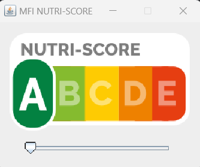

# NutriScore
MFI's nutriscore test

## Description
A little program under GPL that displays a nutriscore image with a selected value (see https://en.wikipedia.org/wiki/Nutri-Score).
User can interact with a slider under the image and change the value.
A timer also gets a random value from an API (https://www.random.org/) and updates the view.

## Development

### Architecture
The project implements the MVC pattern.

### Swing Implementation choices
The nutriscore is rendered by selecting one of the 5 possible images (with A selected, with B, ...).
It uses a JLabel where the imageIcon is updated.

### Compilation
The project uses maven to generate the jar.

### IDE
IntelliJ IDEA has been used to develop, and .idea folder contains workspace data for it.

### Launch
Code is written in java 17, and can be executed via 2 scripts .bat and .sh.

### Tests
No unit tests or other tests are written yet.

## Documentation
The input "specification" is present in folder "docs".

## Traces
There's actually no logger defined. Information and errors are printed directly in console.

